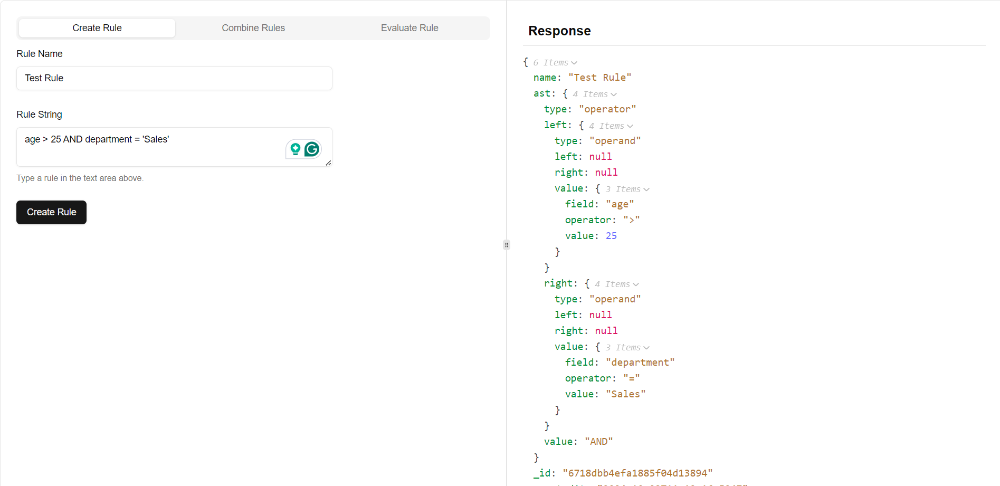
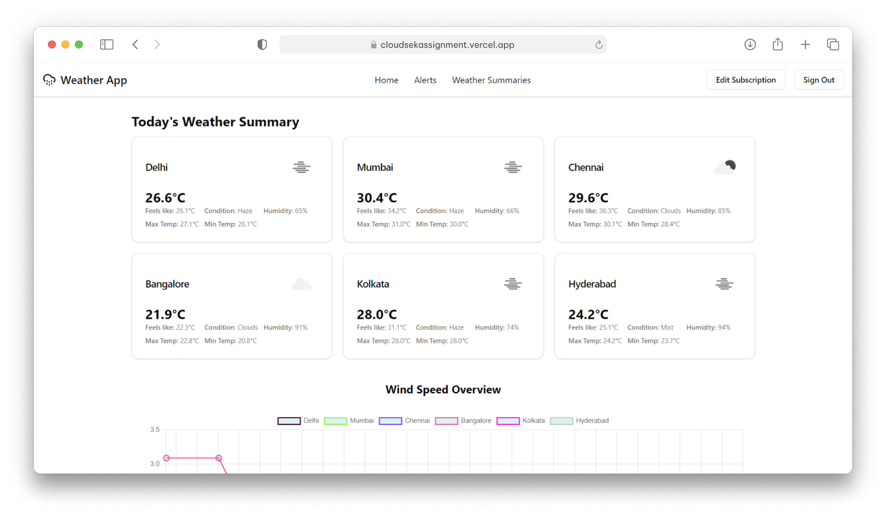

# Rule Engine with Abstract Syntax Tree (AST)

This project implements a **3-tier rule engine** application that evaluates user eligibility based on various attributes like age, department, income, and experience. The system uses **Abstract Syntax Tree (AST)** to represent conditional rules, allowing dynamic creation, combination, and modification of these rules. It also provides APIs to create, combine, and evaluate rules against user data.

Github Repo: [Rule Engine](https://github.com/thekavikumar/Intern-Assignment)



## Table of Contents

- [Rule Engine with Abstract Syntax Tree (AST)](#rule-engine-with-abstract-syntax-tree-ast)
  - [Table of Contents](#table-of-contents)
  - [Features](#features)
  - [Technologies Used](#technologies-used)
  - [Data Structure](#data-structure)
  - [Setup and Installation](#setup-and-installation)
    - [Prerequisites](#prerequisites)
    - [Installation](#installation)
  - [Usage](#usage)
    - [Creating Rules](#creating-rules)
    - [Combining Rules](#combining-rules)
    - [Evaluating Rules](#evaluating-rules)
  - [API Design](#api-design)
    - [Rule Routes](#rule-routes)
  - [Tests](#tests)
  - [Bonus Features](#bonus-features)
- [Real-Time Weather Monitoring System](#real-time-weather-monitoring-system)
  - [Table of Contents](#table-of-contents-1)
  - [Features](#features-1)
  - [Technologies Used](#technologies-used-1)
  - [Setup and Installation](#setup-and-installation-1)
    - [Prerequisites](#prerequisites-1)
    - [Installation](#installation-1)
  - [Usage](#usage-1)
    - [Fetching Weather Data](#fetching-weather-data)
    - [User Subscription](#user-subscription)
    - [Email Alerts](#email-alerts)
  - [Routes](#routes)
    - [User Routes](#user-routes)
    - [Weather Routes](#weather-routes)
  - [Alerts](#alerts)
  - [Tests](#tests-1)
  - [Bonus Features](#bonus-features-1)
  - [Contact](#contact)

## Features

- **Rule Creation**: Create individual eligibility rules using a simple string format, which are converted to an Abstract Syntax Tree (AST) for processing.
- **Rule Combination**: Combine multiple rules into a single AST for efficient evaluation.
- **Eligibility Evaluation**: Evaluate user data against created rules and return whether the user meets the eligibility criteria.
- **AST Modification**: Dynamically modify, create, or combine rules, offering flexibility in rule handling.
- **Data Validation**: Ensure that rules and user data are valid and handle errors gracefully.

## Technologies Used

- **Backend**:
  - Node.js
  - Express
  - MongoDB (via Mongoose) for storing rules and metadata
- **Frontend**:
  - Next.js for UI
  - TailwindCSS for styling
- **Other Tools**:
  - Docker for containerization
  - Environment variable management via `.env` files

## Data Structure

- **Node Structure**: The AST is built using a tree-like data structure where:
  - `type`: Indicates the node type, either "operator" (for AND/OR) or "operand" (for conditions like age > 30).
  - `left`: Reference to the left child node.
  - `right`: Reference to the right child node.
  - `value`: Optional value for operand nodes, such as a comparison value (e.g., salary > 50000).

**Sample Rule Representation**:

Example rule:  
`"((age > 30 AND department = 'Sales') OR (age < 25 AND department = 'Marketing')) AND (salary > 50000 OR experience > 5)"`

This would be represented as an AST with the top node being an AND operator, and its left and right children as sub-rules.

## Setup and Installation

### Prerequisites

- [Node.js](https://nodejs.org/en/) (version 14 or higher)
- [MongoDB](https://www.mongodb.com/) (local or cloud instance)
- [Docker](https://www.docker.com/) (optional, for containerized deployment)

### Installation

1. Clone the repository:

   ```bash
   git clone https://github.com/thekavikumar/ruleengine.git
   ```

2. Navigate to the project directory:

   ```bash
   cd ruleengine
   ```

3. Install backend and frontend dependencies:

   ```bash
   cd backend
   npm install
   cd ../frontend
   npm install
   ```

4. Rename the `.env.example` files in the `backend` and `frontend` directories to `.env` and configure your environment variables.

5. (Optional) If using Docker, create and run the containers:

   ```bash
   docker-compose up --build
   ```

6. Start the backend server (if not using Docker):

   ```bash
   cd backend
   npm start
   ```

7. Start the frontend app (if not using Docker):

   ```bash
   cd frontend
   npm run dev
   ```

8. Access the frontend at [http://localhost:3000](http://localhost:3000).

## Usage

### Creating Rules

Use the `/api/rules/create` endpoint to create a new rule. The rule will be converted into an AST and stored in the database.

Example rule:  
`"((age > 30 AND department = 'Sales') OR (age < 25 AND department = 'Marketing')) AND (salary > 50000 OR experience > 5)"`

### Combining Rules

Use the `/api/rules/combine` endpoint to combine multiple rules into a single AST. This helps in evaluating complex eligibility criteria by optimizing the rule structure.

### Evaluating Rules

Use the `/api/rules/evaluate` endpoint to evaluate a user's data against the combined AST rule. It returns `true` if the user meets the criteria, otherwise `false`.

Example user data:

```json
{
  "age": 35,
  "department": "Sales",
  "salary": 60000,
  "experience": 3
}
```

## API Design

### Rule Routes

| Route                      | Method | Description                                     |
| -------------------------- | ------ | ----------------------------------------------- |
| `/api/rules/create_rule`   | POST   | Parse a rule string and create its AST          |
| `/api/rules/combine_rules` | POST   | Combine multiple rule strings into a single AST |
| `/api/rules/evaluate_rule` | POST   | Evaluate the AST against user data              |

- **POST: `/create_rule`**  
  This route creates a rule by parsing a rule string into an AST and saving it in the database.

  - **Request Body**:
    - `rule_string` (string): The rule to be parsed.
    - `name` (string): The name of the rule.
  - **Success Response**: Returns the created rule in JSON format if the rule is valid and saved.
  - **Error Response**: Returns an error message for invalid rule format or saving issues.

- **POST: `/combine_rules`**  
  This route combines multiple rules into a single AST and saves the combined rule in the database.

  - **Request Body**:
    - `rule_strings` (array): List of rule strings to combine.
    - `name` (string): The name of the combined rule.
  - **Success Response**: Returns the combined rule in JSON format.
  - **Error Response**: Returns an error message if the combination fails.

- **POST: `/evaluate_rule`**  
  This route evaluates a user’s data against a provided rule string (in AST format).
  - **Request Body**:
    - `rule_string` (string): The AST of the rule to evaluate.
    - `userData` (object): User attributes to be checked against the rule.
  - **Success Response**: Returns `true` or `false` based on whether the user's data satisfies the rule.
  - **Error Response**: Returns an error if evaluation fails.

## Tests

The system includes tests to verify the following functionalities:

1. **Rule Creation**: Ensure that rules are correctly parsed into AST structures.
2. **Rule Combination**: Validate that multiple rules can be merged into a single AST.
3. **Rule Evaluation**: Test various user data inputs against sample rules.
4. **Error Handling**: Check for handling of invalid rule strings or incomplete data.

## Bonus Features

1. **Dockerized Setup**: Enabled containerization with Docker for easier deployment.
2. **Data Validations**: Added validation for rule attributes to match a predefined catalog.

# Real-Time Weather Monitoring System

This project implements a real-time weather monitoring system that retrieves data from the [OpenWeatherMap API](https://openweathermap.org/) to track and summarize weather conditions for major Indian cities. The system processes this data to provide real-time insights, including daily weather summaries, temperature rollups, and alert notifications when weather thresholds are exceeded. To optimize performance, the project leverages **React Server Components** for faster data fetching and improved UI responsiveness.

Github Repo: [Weather Monitoring System](https://github.com/thekavikumar/weatherapp)



## Table of Contents

- [Rule Engine with Abstract Syntax Tree (AST)](#rule-engine-with-abstract-syntax-tree-ast)
  - [Table of Contents](#table-of-contents)
  - [Features](#features)
  - [Technologies Used](#technologies-used)
  - [Data Structure](#data-structure)
  - [Setup and Installation](#setup-and-installation)
    - [Prerequisites](#prerequisites)
    - [Installation](#installation)
  - [Usage](#usage)
    - [Creating Rules](#creating-rules)
    - [Combining Rules](#combining-rules)
    - [Evaluating Rules](#evaluating-rules)
  - [API Design](#api-design)
    - [Rule Routes](#rule-routes)
  - [Tests](#tests)
  - [Bonus Features](#bonus-features)
- [Real-Time Weather Monitoring System](#real-time-weather-monitoring-system)
  - [Table of Contents](#table-of-contents-1)
  - [Features](#features-1)
  - [Technologies Used](#technologies-used-1)
  - [Setup and Installation](#setup-and-installation-1)
    - [Prerequisites](#prerequisites-1)
    - [Installation](#installation-1)
  - [Usage](#usage-1)
    - [Fetching Weather Data](#fetching-weather-data)
    - [User Subscription](#user-subscription)
    - [Email Alerts](#email-alerts)
  - [Routes](#routes)
    - [User Routes](#user-routes)
    - [Weather Routes](#weather-routes)
  - [Alerts](#alerts)
  - [Tests](#tests-1)
  - [Bonus Features](#bonus-features-1)
  - [Contact](#contact)

## Features

- **Real-time Weather Monitoring**: The system continuously retrieves weather data for major Indian cities (Delhi, Mumbai, Chennai, Bangalore, Kolkata, Hyderabad) at configurable intervals (default: 5 minutes).
- **Daily Weather Summaries**: It computes daily weather aggregates such as average, maximum, and minimum temperatures, and identifies the dominant weather condition (e.g., Rain, Clear, Snow).
- **User Subscription**: Users can subscribe to custom weather alerts and set thresholds for temperature monitoring.
- **Alerts System**: The system sends email notifications to users when predefined weather conditions are exceeded.
- **Visualizations**: Future updates will introduce dashboards for visualizing weather trends.
- **React Server Components**: Utilized React Server Components to speed up data fetching and improve UI rendering by processing the most intensive server-side tasks.

## Technologies Used

- **Backend**:
  - Node.js
  - Express
  - MongoDB (via Mongoose)
  - OpenWeatherMap API
  - Node-cron for scheduled tasks
  - Nodemailer for email alerts
- **Frontend**:
  - Next.js (with React Server Components for improved performance)
  - Kinde for authentication
  - TailwindCSS for styling
- **Other Tools**:
  - Docker & Docker Compose (for containerization)
  - Environment variable management via `.env` files

## Setup and Installation

### Prerequisites

- [Node.js](https://nodejs.org/en/) (version 14 or higher)
- [MongoDB](https://www.mongodb.com/) (local or cloud instance)
- OpenWeatherMap API Key (sign up [here](https://home.openweathermap.org/users/sign_up))
- [Docker](https://www.docker.com/) (optional, for containerized deployment)

### Installation

1. Clone the repository:

   ```bash
   git clone https://github.com/thekavikumar/weatherapp.git
   ```

2. Navigate to the project directory:

   ```bash
   cd weatherapp
   ```

3. Install backend and frontend dependencies:

   ```bash
   cd backend
   npm install
   cd ../frontend
   npm install
   ```

4. Rename the `.env.example` files in the `backend` and `frontend` directories to `.env` and you are good to go.

5. (Optional) If using Docker, create and run the containers:

   ```bash
   docker-compose up --build
   ```

6. Start the backend server (if not using Docker):

   ```bash
   cd backend
   npm start
   ```

7. Start the frontend app (if not using Docker):

   ```bash
   cd frontend
   npm run dev
   ```

8. Access the frontend at [http://localhost:3000](http://localhost:3000).

## Usage

### Fetching Weather Data

The system fetches weather data for the configured cities every 5 minutes using cron jobs. You can adjust the interval in the `cron.schedule` expression in the `server.js` file.

### User Subscription

Users can subscribe to receive weather alerts via the provided API routes (see below) and set custom thresholds for temperature alerts.

### Email Alerts

When weather conditions exceed user-defined thresholds, the system sends an email alert using Nodemailer.

## Routes

### User Routes

| Route                                  | Method | Description                           |
| -------------------------------------- | ------ | ------------------------------------- |
| `/api/user/subscribe`                  | POST   | Subscribe to weather alerts           |
| `/api/user/update-subscription/:email` | PUT    | Update a user's subscription settings |
| `/api/user/check-subscription/:email`  | GET    | Check if a user is subscribed         |
| `/api/user/unsubscribe/:email`         | DELETE | Unsubscribe from weather alerts       |
| `/api/user/alerts/:email`              | GET    | Retrieve all alerts sent to a user    |

### Weather Routes

| Route                           | Method | Description                     |
| ------------------------------- | ------ | ------------------------------- |
| `/api/weather/weathersummaries` | GET    | Get all daily weather summaries |
| `/api/weather/updates`          | GET    | Get all recent weather updates  |

## Alerts

- **Alerting Thresholds**: Users can set custom thresholds for temperature (e.g., receive an alert if the temperature exceeds 35°C for two consecutive updates).
- **Email Notifications**: Alerts are sent to users via Gmail's SMTP service.

## Tests

The system includes test cases to verify key functionalities:

1. **System Setup**: Ensures the server starts and connects to OpenWeatherMap API.
2. **Data Retrieval**: Tests that API calls to OpenWeatherMap are made at scheduled intervals and the data is parsed correctly.
3. **Temperature Conversion**: Confirms correct conversion of temperature from Kelvin to Celsius (or Fahrenheit, if extended).
4. **Daily Weather Summaries**: Verifies that daily summaries (average, max, min) are computed accurately.
5. **Alerting Mechanism**: Simulates weather conditions to ensure alerts are triggered when thresholds are breached.

## Bonus Features

1. **User Authentication**: Integrated user authentication using Kinde.
2. **Email Alerts**: Configured email alerts using Nodemailer.
3. **Dockerized Setup**: Enabled containerization with Docker.
4. **Extended Metrics**: Added support for humidity, wind speed, and other weather metrics.
5. **React Server Components**: Used React Server Components for faster server-side data handling and performance optimization.

## Contact

- 📩 Email: kavikumar.hackathons@gmail.com
- 🌐 LinkedIn: [Kavikumar M](https://www.linkedin.com/in/thekavikumar/)
- 🚀 Portfolio: [kavikumar.vercel.app](https://kavikumar.vercel.app/)
